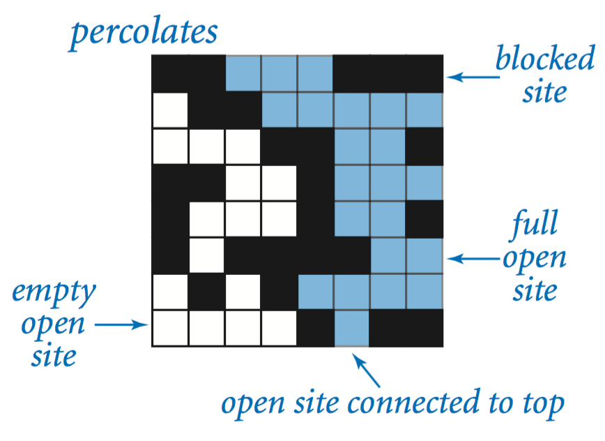

 # _percolation threshold_ via Monte Carlo simulation

Write a program to estimate the value of the _percolation threshold_ via Monte Carlo simulation.

**Install our Java programming environment (optional).** Install our custom IntelliJ programming environment by following these step-by-step instructions for your operating system \[ [Mac OS X](https://lift.cs.princeton.edu/java/mac) · [Windows](https://lift.cs.princeton.edu/java/windows) · [Linux](https://lift.cs.princeton.edu/java/linux) \].

After following these instructions, the commands `javac-algs4` and `java-algs4` will classpath in [algs4.jar](https://algs4.cs.princeton.edu/code/algs4.jar), which contains Java classes for I/O and all of the algorithms in the textbook. To access a class in `algs4.jar`, you need an `import` statement, such as the ones below:

> import edu.princeton.cs.algs4.StdRandom;
> import edu.princeton.cs.algs4.StdStats;
> import edu.princeton.cs.algs4.WeightedQuickUnionUF;

Note that _your_ code must be in the _default package_; if you use a `package` statement, the autograder will reject your submission.

**Percolation.** Given a composite systems comprised of randomly distributed insulating and metallic materials: what fraction of the materials need to be metallic so that the composite system is an electrical conductor? Given a porous landscape with water on the surface (or oil below), under what conditions will the water be able to drain through to the bottom (or the oil to gush through to the surface)? Scientists have defined an abstract process known as _percolation_ to model such situations.

**The model.** We model a percolation system using an _n_\-by-_n_ grid of _sites_. Each site is either _open_ or _blocked_. A _full_ site is an open site that can be connected to an open site in the top row via a chain of neighboring (left, right, up, down) open sites. We say the system _percolates_ if there is a full site in the bottom row. In other words, a system percolates if we fill all open sites connected to the top row and that process fills some open site on the bottom row. (For the insulating/metallic materials example, the open sites correspond to metallic materials, so that a system that percolates has a metallic path from top to bottom, with full sites conducting. For the porous substance example, the open sites correspond to empty space through which water might flow, so that a system that percolates lets water fill open sites, flowing from top to bottom.)

>            

**The problem.** In a famous scientific problem, researchers are interested in the following question: if sites are independently set to be open with probability _p_ (and therefore blocked with probability 1 − _p_), what is the probability that the system percolates? When _p_ equals 0, the system does not percolate; when _p_ equals 1, the system percolates. The plots below show the site vacancy probability _p_ versus the percolation probability for 20-by-20 random grid (left) and 100-by-100 random grid (right).

                          

When _n_ is sufficiently large, there is a _threshold_ value _p_\* such that when _p_ < _p_\* a random _n_\-by-_n_ grid almost never percolates, and when _p_ > _p_\*, a random _n_\-by-_n_ grid almost always percolates. No mathematical solution for determining the percolation threshold _p_\* has yet been derived. Your task is to write a computer program to estimate _p_\*.

**Percolation data type.** To model a percolation system, create a data type `Percolation` with the following API:

```java
 public class Percolation {
 
     // creates n-by-n grid, with all sites initially blocked
     public Percolation(int n)
 
     // opens the site (row, col) if it is not open already
     public void open(int row, int col)
 
     // is the site (row, col) open?
     public boolean isOpen(int row, int col)
 
     // is the site (row, col) full?
     public boolean isFull(int row, int col)
 
     // returns the number of open sites
     public int numberOfOpenSites()
 
     // does the system percolate?
     public boolean percolates()
 
     // test client (optional)
     public static void main(String\[\] args)
 }
 ```

_Corner cases._  By convention, the row and column indices are integers between 1 and _n_, where (1, 1) is the upper-left site: Throw an `IllegalArgumentException` if any argument to `open()`, `isOpen()`, or `isFull()` is outside its prescribed range. Throw an `IllegalArgumentException` in the constructor if _n_ ≤ 0.

_Performance requirements._  The constructor must take time proportional to _n_2; all instance methods must take constant time plus a constant number of calls to `union()` and `find()`.

**Monte Carlo simulation.** To estimate the percolation threshold, consider the following computational experiment:

*   Initialize all sites to be blocked.
    
*   Repeat the following until the system percolates:
    
    *   Choose a site uniformly at random among all blocked sites.
        
    *   Open the site.
    
*   The fraction of sites that are opened when the system percolates provides an estimate of the percolation threshold.

For example, if sites are opened in a 20-by-20 lattice according to the snapshots below, then our estimate of the percolation threshold is 204/400 = 0.51 because the system percolates when the 204th site is opened.

     

  

_50 open sites_

  

_100 open sites_

  

_150 open sites_

  

_204 open sites_

By repeating this computation experiment _T_ times and averaging the results, we obtain a more accurate estimate of the percolation threshold. Let _xt_ be the fraction of open sites in computational experiment _t_. The sample mean \\(\\overline x\\) provides an estimate of the percolation threshold; the sample standard deviation _s_; measures the sharpness of the threshold.

> \\\[ \\overline x = \\frac{x\_1 \\, + \\, x\_2 \\, + \\, \\cdots \\, + \\, x\_{T}}{T}, \\quad s^2 = \\frac{(x\_1 - \\overline x )^2 \\, + \\, (x\_2 - \\overline x )^2 \\,+\\, \\cdots \\,+\\, (x\_{T} - \\overline x )^2}{T-1} \\\]

Assuming _T_ is sufficiently large (say, at least 30), the following provides a 95% confidence interval for the percolation threshold:

> \\\[ \\left \[ \\; \\overline x - \\frac {1.96 s}{\\sqrt{T}}, \\;\\; \\overline x + \\frac {1.96 s}{\\sqrt{T}} \\; \\right\] \\\]

To perform a series of computational experiments, create a data type `PercolationStats` with the following API.

```java
 public class PercolationStats {
 
     // perform independent trials on an n-by-n grid
     public PercolationStats(int n, int trials)
 
     // sample mean of percolation threshold
     public double mean()
 
     // sample standard deviation of percolation threshold
     public double stddev()
 
     // low endpoint of 95% confidence interval
     public double confidenceLo()
 
     // high endpoint of 95% confidence interval
     public double confidenceHi()
 
    // test client (see below)
    public static void main(String\[\] args)
 
 }
 ```

Throw an `IllegalArgumentException` in the constructor if either _n_ ≤ 0 or _trials_ ≤ 0.

Also, include a `main()` method that takes two _command-line arguments_ _n_ and _T_, performs _T_ independent computational experiments (discussed above) on an _n_\-by-_n_ grid, and prints the sample mean, sample standard deviation, and the _95% confidence interval_ for the percolation threshold. Use [`StdRandom`](https://algs4.cs.princeton.edu/code/javadoc/edu/princeton/cs/algs4/StdRandom.html) to generate random numbers; use [`StdStats`](https://algs4.cs.princeton.edu/code/javadoc/edu/princeton/cs/algs4/StdStats.html) to compute the sample mean and sample standard deviation.

```console
 ~/Desktop/percolation> java-algs4 PercolationStats 200 100
 mean                    = 0.5929934999999997
 stddev                  = 0.00876990421552567
 95% confidence interval = \[0.5912745987737567, 0.5947124012262428\]
 
 ~/Desktop/percolation> java-algs4 PercolationStats 200 100
 mean                    = 0.592877
 stddev                  = 0.009990523717073799
 95% confidence interval = \[0.5909188573514536, 0.5948351426485464\]
 
 ~/Desktop/percolation> java-algs4 PercolationStats 2 10000
 mean                    = 0.666925
 stddev                  = 0.11776536521033558
 95% confidence interval = \[0.6646167988418774, 0.6692332011581226\]
 
 ~/Desktop/percolation> java-algs4 PercolationStats 2 100000
 mean                    = 0.6669475
 stddev                  = 0.11775205263262094
 95% confidence interval = \[0.666217665216461, 0.6676773347835391\]
 ```

**Analysis of running time and memory usage (optional and not graded).** Implement the `Percolation` data type using the _quick find_ algorithm in [`QuickFindUF`](https://algs4.cs.princeton.edu/code/javadoc/edu/princeton/cs/algs4/QuickFindUF.html).

*   Use [`Stopwatch`](https://algs4.cs.princeton.edu/code/javadoc/edu/princeton/cs/algs4/Stopwatch.html) to measure the total running time of `PercolationStats` for various values of _n_ and _T_. How does doubling _n_ affect the total running time? How does doubling _T_ affect the total running time? Give a formula (using tilde notation) of the total running time on your computer (in seconds) as a single function of both _n_ and _T_.
    
*   Using the 64-bit memory-cost model from lecture, give the total memory usage in bytes (using tilde notation) that a `Percolation` object uses to model an _n_\-by-_n_ percolation system. Count all memory that is used, including memory for the union–find data structure.

Now, implement the `Percolation` data type using the _weighted quick union_ algorithm in [`WeightedQuickUnionUF`](https://algs4.cs.princeton.edu/code/javadoc/edu/princeton/cs/algs4/WeightedQuickUnionUF.html). Answer the questions in the previous paragraph.

**Web submission.** Submit a .zip file containing only Submit only `Percolation.java` (using the weighted quick-union algorithm from [`WeightedQuickUnionUF`](https://algs4.cs.princeton.edu/code/javadoc/edu/princeton/cs/algs4/WeightedQuickUnionUF.html)) and `PercolationStats.java`. We will supply `algs4.jar`. Your submission may not call library functions except those in [`StdIn`](https://algs4.cs.princeton.edu/code/javadoc/edu/princeton/cs/algs4/StdIn.html), [`StdOut`](https://algs4.cs.princeton.edu/code/javadoc/edu/princeton/cs/algs4/StdOut.html), [`StdRandom`](https://algs4.cs.princeton.edu/code/javadoc/edu/princeton/cs/algs4/StdRandom.html), [`StdStats`](https://algs4.cs.princeton.edu/code/javadoc/edu/princeton/cs/algs4/StdStats.html), [`WeightedQuickUnionUF`](https://algs4.cs.princeton.edu/code/javadoc/edu/princeton/cs/algs4/WeightedQuickUnionUF.html), and `java.lang`.

**For fun.** Create your own percolation input file and share it in the discussion forums. For some inspiration, do an image search for “nonogram puzzles solved.”

  

This assignment was developed by Bob Sedgewick and Kevin Wayne.  
Copyright © 2008.


  